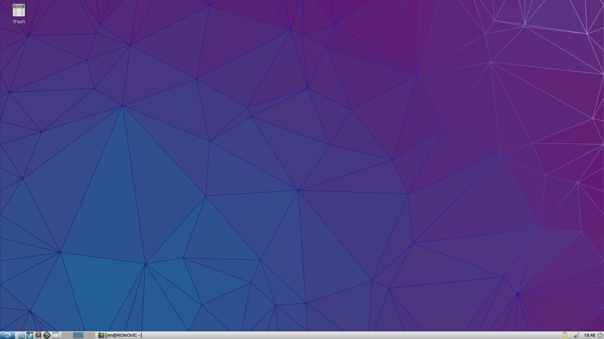
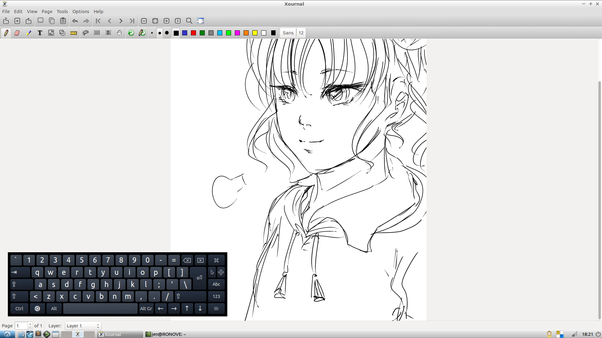

Today I get a notification from Lubuntu informing me that an upgrade is available to 15.10, or Wily Werewolf. I was mildly interested and thought why not, and started the installation.

Along the way, somehow I had butchered the upgrade process. Let's say that in the middle of doing a remote session onto my Windows desktop, I accidentally used the Ctrl + Alt + Del shortcut to attempt to log in, not realizing that it indeed has a function in Linux: to perform a soft reboot.

Lubuntu was a mess by that point. Networking was completely out of whack, my Windows drive could not be accessed to transfer files over, and although it still looks like Trusty Tahr, Linux believed it had already upgraded to Wily Werewolf.

It didn't take much to convince me to wait until I was home to fix it.

I managed to back up what files that weren't on Git on a USB and set off to reinstall Lubuntu. The process didn't take long at all, which is a feature that's hard not to like about Linux. In about 10 minutes after booting the Live USB, I was ready to run Wily Werewolf.

It's a nice feeling to have after a fresh OS install. I took my time getting all my necessary applications back on: Chrome, Sublime Text 3, DeaDBeeF, as well as grub-customizer and Shutter. I went back to my previous Linux blog posts and got my startup script working for xbacklight.

This was also a good time for me to try out [admiralakber's Thinkpad Yoga S1 scripts](https://github.com/admiralakber/thinkpad-yoga-scripts) which I had starred on GitHub a while back but didn't get to test. I might as well see if Linux's tablet capabilities rival Windows's. The scripts were easy to install and by the end of it, I was ecstatic. The screen orientation changes? The backlight works? The touch input is disabled when the Wacom pen is hovering over the screen? All of this was working so well I was almost convinced it was black magic.

In addition, [admiralackber's blog post](http://blog.admiralakber.com/?p=400) about these scripts let me find a new application: [Xournal](http://xournal.sourceforge.net/). This seems like a simple note-taking program that allowed PDF annotation and drawing. Curiously, the screenshot showed traces of pressure sensitivity, so out of curiosity, I tried Xournal and at that point I was done.

In the end, it was a nice journey through reinstalling, and I even learned a few new things here and there. That doesn't mean I endorse completely trashing your OS's next software update, but it is really up to you! Always take precautions though, and always do a backup.