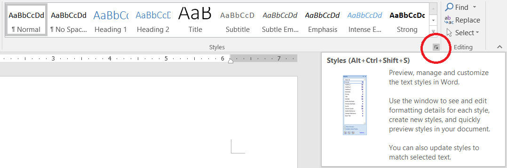
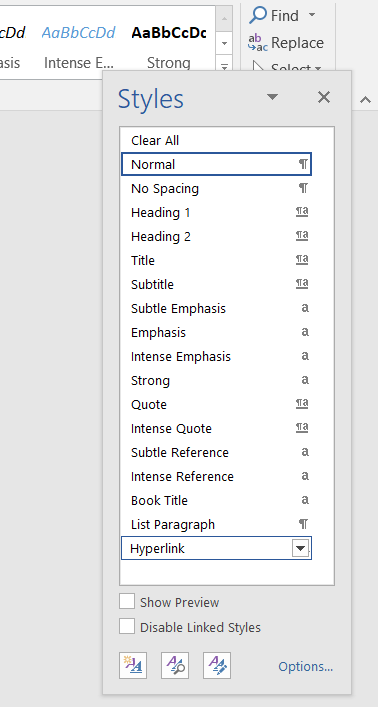
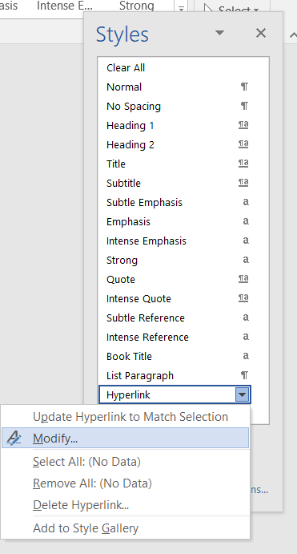
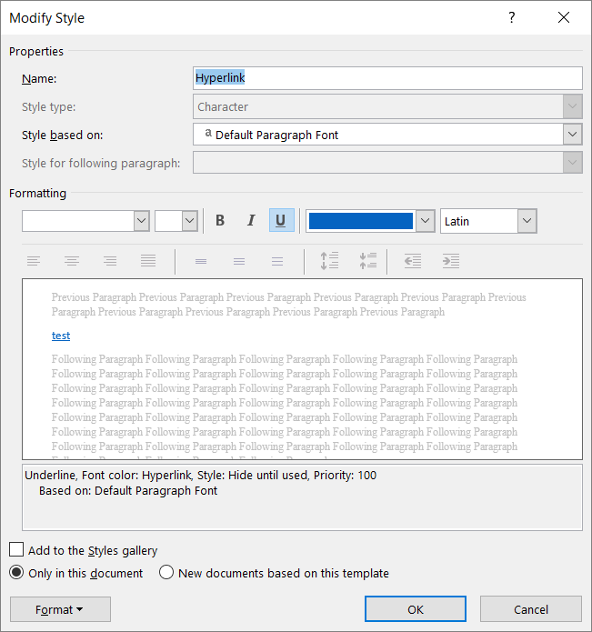

While updating my resume, I wanted to change how my hyperlinks looked all at once (because who wants to manually update each link's font and remove the underline?).

Here's a trick I learned to update a document's hyperlink style to save time and frustration. I use Microsoft Word 2016 in this scenario.

First, open a document with some hyperlinks you want to change. While on the Home tab, check the bottom corner of Styles for an extra menu button.

Click on it, and a list of styles available on the document appears. Because the document has hyperlinks, there should be a style called Hyperlinks displayed.

Hovering over it will reveal a dropdown button, which gives a variety of options on editing the Hyperlink style.

I usually select **Modify...** so that I can see the following Modify Style dialog, giving me more power over how to edit the style.

Now I can remove all of those pesky underlines from my hyperlinks all at once!