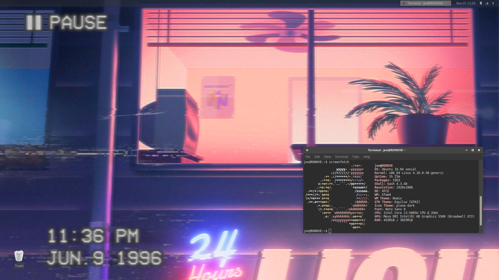

After using Lubuntu for a while, I wanted a change. It was time to try a new Linux distro.

My criteria: something that is lightweight (still want to run it on the 12 GB SSD) but with just enough power for a friendlier user interface and room for customization. I considered Arch due to its massive fanbase and its endless customization options, but it felt like jumping into the deep end too soon. I chickened out and stuck with the Ubuntu family.

I decided to try Xubuntu, what seemed to be a more feature-filled version of Lubuntu, but not to the point of its popular brother Ubuntu.

So far, I've gotten pretty comfortable with Xubuntu, and even went ahead with making visual customizations. I spent several hours trying to find the perfect combo of XFCE themes, window managers, icons, cursors, wallpapers, and so on; [opendesktop.org](http://opendesktop.org) was very useful for this.

I also learned of a new word: _ricing_. According to [/r/unixporn](https://www.reddit.com/r/unixporn/wiki/themeing/dictionary#wiki_rice), it refers to customizing and making visual improvements to the desktop environment. It has its roots in modifying imported Asian cars, which is pretty interesting.

Here I used the command `screenfetch` to display stats about my Xubuntu customization, including my theme and font choices.

If you want to try it out on your environment, here is how you install it:

	sudo apt install screenfetch

The results:

	OS: Ubuntu 16.04 xenial
	Kernel: x86_64 Linux 4.10.0-38-generic
	Uptime: 1h 15m
	Packages: 1657
	Shell: bash 4.3.48
	Resolution: 1920x1080
	DE: XFCE
	WM: Xfwm4
	WM Theme: Numix
	GTK Theme: Equilux [GTK2]
	Icon Theme: plane-dark
	Font: Noto Sans 9
	CPU: Intel Core i3-5005U CPU @ 2GHz
	GPU: Mesa DRI Intel(R) HD Graphics 5500 (Broadwell GT2) 
	RAM: 2018MiB / 3855MiB