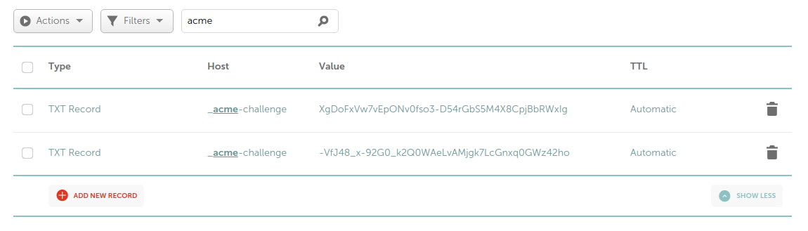

It's increasingly important to obtain an HTTPS certificate in order to ensure websites are running as intended in various browsers. So I took in upon myself to set one up for my domain.

To get started, I went to [Let's Encrypt's Getting Started page](https://letsencrypt.org/), and having shell access I was directed to [Certbot](https://certbot.eff.org/). I selected the OS and server I use (Ubuntu 18.04 and Nginx), and followed the instructions until the actual `certbot` command.

Now, I wanted to have a wildcard certificate so that anything falling under my domain is secured with HTTPS (`*.jyntran.ca` rather than only `www.jyntran.ca`).

This is the command I used to set one up:

```
sudo certbot certonly --config /etc/letsencrypt/config.ini --agree-tos --manual-public-ip-logging-ok --preferred-challenges dns-01 --manual -d *.jyntran.ca -d jyntran.ca
```

Lots of stuff going on here! Basically, this command does the following:

- Generate only the certificate, and do not install it (modifying my current configuration files)
- Agree to the Terms of Service (TOS) automatically
- Agree to having my public IP logged automatically
- Use manual mode so I perform the certificate validation myself
- Prefer the challenge over DNS instead of HTTP
- State the domains I want to set up my certificate with

I was guided through the setup process very smoothly. For the DNS validation portion, this requires me to set up TXT records on my domain to complete the challenge. I manage my domain on Namecheap, so in *Advanced DNS*, I add a new record when prompted by Certbot:

```
Type: TXT Record
Host: _acme-challenge
Value: <provided by Certbot>
TTL: Automatic
```

To check that the record is active and deployed, I used this command:

```
host -t txt _acme-challenge.jyntran.ca
```

Which comes back with this output:

```
_acme-challenge.jyntran.ca descriptive text "XgDoFxVw7vEpONv0fso3-D54rGbS5M4X8CpjBbRWxIg"
```

Looks good! The setup will prompt to create a second challenge, so I ended up with two TXT records.



Once setup is completed, I finally had the certificate. Next was setting up my Nginx configurations (because I chose to do it manually).

```
sudo vim /etc/nginx/sites-available/jyntran.ca
```

In here I made the following modifications:

```
# nginx jyntran.ca

server {
        listen 80;
        listen [::]:80;

        server_name jyntran.ca www.jyntran.ca;
        return 301 https://$server_name$request_uri;
}

server {
        listen 443 ssl;
        listen [::]:443 ssl;

        include snippets/ssl.conf;

        ssl_certificate /etc/letsencrypt/live/jyntran.ca/fullchain.pem;
        ssl_certificate_key /etc/letsencrypt/live/jyntran.ca/privkey.pem;

        ...
```

See how I split it into two servers? The first is for HTTP, and will force HTTPS. The HTTP code `301` means Moved Permanently.

The second, I indicate `ssl` on port `443`. This is where I include the paths for `ssl_certificate` and `ssl_certificate_key`.

There's also a snippet I included from `/etc/nginx/snippets/ssl.conf`. This is a file with some configurations specific to SSL and additional security. An example can be looked at on [Cipherli.st](https://cipherli.st), and can be copied and pasted.

Here's what they have for Nginx:
```
ssl_protocols TLSv1.3;# Requires nginx >= 1.13.0 else use TLSv1.2
ssl_prefer_server_ciphers on; 
ssl_dhparam /etc/nginx/dhparam.pem; # openssl dhparam -out /etc/nginx/dhparam.pem 4096
ssl_ciphers EECDH+AESGCM:EDH+AESGCM;
ssl_ecdh_curve secp384r1; # Requires nginx >= 1.1.0
ssl_session_timeout  10m;
ssl_session_cache shared:SSL:10m;
ssl_session_tickets off; # Requires nginx >= 1.5.9
ssl_stapling on; # Requires nginx >= 1.3.7
ssl_stapling_verify on; # Requires nginx => 1.3.7
resolver $DNS-IP-1 $DNS-IP-2 valid=300s;
resolver_timeout 5s; 
add_header Strict-Transport-Security "max-age=63072000; includeSubDomains; preload";
add_header X-Frame-Options DENY;
add_header X-Content-Type-Options nosniff;
add_header X-XSS-Protection "1; mode=block";
```

Finally, everything should be ready, so I tested the configuration and restart Nginx.

```
sudo nginx -t && sudo service nginx reload
```

*HTTP est mort, vive HTTPS!*